Proyecto 3
================

# Análisis de deportes de resistencia

En el presente proyecto se busca clasificar las actividades hechas por
deportistas de resistencia, los cuales llevan registro de estas en
dispositivos digitales, tales como smart bands, celulares, smartwatch u
otro dispositivo que tenga la capacidad de sincronizarse con
aplicaciones que tengan compatibilidad para deporte.

Es importante clasificar de buena manera estas actividades, porque se
mantiene un sistemas de ranking y premios que se pueden ver afectados
por actividades mal ingresadas por los usuarios, ya que dependiendo de
la actividad que uno realice, se iran generando estadisticas para estos
premios y records que se mencionaron anteriormente.

Estos errores al ingresar las actividades, se pueden deber a que se
registro de manera accidental o intencionada el deporte que uno esta
realizando, como por ejemplo registrar una actividad de bicicleta como
de running. De esta manera es evidente que se podrían encontrar
mediciones atipicas.

El objetivo principal de este proyecto es diferenciar las actividades
realizadas en bicicleta o a pie de acuerdo a características como la
distancia recorrida, la velocidad promedio, entre otros atributos
capturados por los dispositivos de rastreo. Como objetivo secundario se
plantea identificar las actividades que fueron registradas errónameante
por los usuarios.

## Carga de Librerías

Para poder comenzar con los analisis pertinentes para este proyecto es
necesario en primer lugar cargar las librerías con las que se trabajara
para hacer los procedimientos necesarios.

## Cargar datos

Luego es necesario cargar los datos, ya que en base a estos se iran
haciendo los analisis para poder cumplir los objetivos planteados en la
actividad. Esta base de datos consta de 167.615 observaciones, en donde
se tomaron 17 variables. Estas serán guardadas en la variable
sport\_ori.

``` r
setwd("C:/Users/amanh/OneDrive/Documentos/GitHub/Proyecto-3")
sport_ori <- readRDS("C:/Users/amanh/OneDrive/Documentos/GitHub/Proyecto-3/endurance.rds")
```

## Limpieza de datos

### Busqueda de Valores NA

En primer lugar es necesario verificar que no existan datos que sean del
tipo NA. Para esto se utiliza la funcion summary, para de esta manera
visualizar si existen entradas faltantes.

``` r
summary(sport_ori)
```

    ##        id             type              athlete            calories       
    ##  Min.   :     1   Length:167615      Min.   : 8558143   Min.   :     0.0  
    ##  1st Qu.: 41905   Class :character   1st Qu.:14204866   1st Qu.:   281.0  
    ##  Median : 83808   Mode  :character   Median :15621719   Median :   629.0  
    ##  Mean   : 83808                      Mean   :15359426   Mean   :   816.7  
    ##  3rd Qu.:125712                      3rd Qu.:16685446   3rd Qu.:  1076.8  
    ##  Max.   :167615                      Max.   :18078075   Max.   :326157.3  
    ##     distance         elev_low           records           elev_high        
    ##  Min.   :      0   Length:167615      Length:167615      Length:167615     
    ##  1st Qu.:   6159   Class :character   Class :character   Class :character  
    ##  Median :  12968   Mode  :character   Mode  :character   Mode  :character  
    ##  Mean   :  21998                                                           
    ##  3rd Qu.:  27494                                                           
    ##  Max.   :1479320                                                           
    ##   max_speed         device_name         moving_time        elapsed_time      
    ##  Length:167615      Length:167615      Min.   :       0   Min.   :        0  
    ##  Class :character   Class :character   1st Qu.:    2248   1st Qu.:     2582  
    ##  Mode  :character   Mode  :character   Median :    3853   Median :     4450  
    ##                                        Mean   :    5141   Mean   :    32102  
    ##                                        3rd Qu.:    6516   3rd Qu.:     7934  
    ##                                        Max.   :11025474   Max.   :511111044  
    ##  average_speed      has_heartrate      start_date_local             
    ##  Length:167615      Length:167615      Min.   :1999-04-25 17:36:38  
    ##  Class :character   Class :character   1st Qu.:2016-11-23 17:11:10  
    ##  Mode  :character   Mode  :character   Median :2019-01-26 13:37:56  
    ##                                        Mean   :2018-05-12 07:50:32  
    ##                                        3rd Qu.:2020-04-30 04:33:10  
    ##                                        Max.   :2021-02-02 11:37:09  
    ##  total_elevation_gain
    ##  Min.   :    0.0     
    ##  1st Qu.:   15.1     
    ##  Median :  171.0     
    ##  Mean   :  397.0     
    ##  3rd Qu.:  595.0     
    ##  Max.   :59595.0

Podemos apreciar que no hay datos NA, por ende, se continua con la
limpieza de datos. De esta manera evitaremos problemas en los calculos
posteriores, ya que deberemos escalar la data y de esta manera hacer los
analisis pertinentes para nuestro caso.

### Filtro de Variables

En primer lugar procederemos a tener verificar cuales son todos los
tipos de actividades, esto sera por medio de la funcion unique que nos
enseño el profesor.

Además se sacaran ciertas variables que en nuestra opinion no aportar
mayor información de cara a clasificar las actividades deportivas. Estas
serían las de “id”, “athlete”, “device\_name”, “start\_date\_local”,
“records” y “has\_heartrate”.

Uno podria pensar que la variable “has\_heartrate” es importante, ya que
existen ciertos metodos que permiten diferenciar en cierta medida que
deporte se esta realizando de acuerdo a las pulsaciones por minuto. Sin
embargo, la variable indica unicamente si el dispsitivo de monitoreo
estaba midiendo el ritmo cardiaco al momento de hacer las mediciones
(entregando true o false respectivamente). Entonces debido a esto se
elimina esta varibale que podria inducir a pensar que es necesaria para
los analisis.

De todas maneras estas modificaciones no se haran sobre la base
original. Para esto se hara una copia, la cual sera sport y también se
hara otra para poder determinar aquellos registros que fueron ingresados
de manera errónea, sport2.

``` r
sport <- sport_ori
sport2 <- sport_ori
sport$type %>% unique()
```

    ## [1] "Ride"      "Run"       "Walk"      "Hike"      "EBikeRide"

``` r
sport$id <- NULL
sport$athlete <- NULL
sport$device_name <- NULL
sport$start_date_local <- NULL
sport$records <- NULL
sport$has_heartrate <- NULL
sport2$id <- NULL
sport2$athlete <- NULL
sport2$device_name <- NULL
sport2$start_date_local <- NULL
sport2$records <- NULL
sport2$has_heartrate <- NULL
```

Podemos apreciar que existen 5 tipos de mediciones, estas son “Ride”,
“Run”, “Walk”, “Hike” y “EBikeRide”. Adicionalmente, tenemos que hacer
una conversion de variables a numericas (para aquellas que son numeros
pero estan en tipo de dato character). De esta manera no habran
incongruencias al momento de hacer futuros analisis.

Finalmente, para poder categorizar aquellos registros que fueron
realizados a pie y en bicicleta se converitra la variable “type” a
valores de 1 para aquellas que sean en bicicleta y 0 para aquellas que
son a pie.

Luego se deja la variable original “type” nula, para que no sea usada de
nuevo.

``` r
sport$elev_low <- as.numeric(sport$elev_low)
sport$elev_high <- as.numeric(sport$elev_high)
sport$max_speed <- as.numeric(sport$max_speed)
sport$average_speed <- as.numeric(sport$average_speed)
sport2$elev_low <- as.numeric(sport$elev_low)
sport2$elev_high <- as.numeric(sport$elev_high)
sport2$max_speed <- as.numeric(sport$max_speed)
sport2$average_speed <- as.numeric(sport$average_speed)
sport$typeCode <- (sport$type == "Ride" | sport$type == "EBikeRide") %>% as.numeric()
sport$typeCode <- (sport$type == "Run" | sport$type == "Walk" | sport$type == "Hike") %>% as.numeric()
sport2$typeCode <- (sport$type == "Ride" | sport$type == "EBikeRide") %>% as.numeric()
sport2$typeCode <- (sport$type == "Run" | sport$type == "Walk" | sport$type == "Hike") %>% as.numeric()
sport$type <- NULL
sport2$type <- NULL
```

A continuación procedemos con una revisión respecto de si tenemos
valores que sean NA. Primero se revisara en la variable sport y luego en
sport 2.

``` r
summary(sport)
```

    ##     calories           distance          elev_low         elev_high      
    ##  Min.   :     0.0   Min.   :      0   Min.   :-3257.1   Min.   : -500.0  
    ##  1st Qu.:   281.0   1st Qu.:   6159   1st Qu.:  222.8   1st Qu.:  476.8  
    ##  Median :   629.0   Median :  12968   Median :  595.8   Median :  728.8  
    ##  Mean   :   816.7   Mean   :  21998   Mean   :  557.4   Mean   :  848.2  
    ##  3rd Qu.:  1076.8   3rd Qu.:  27494   3rd Qu.:  774.0   3rd Qu.: 1141.4  
    ##  Max.   :326157.3   Max.   :1479320   Max.   :11302.4   Max.   :12606.8  
    ##                                       NA's   :13519     NA's   :13519    
    ##    max_speed        moving_time        elapsed_time       average_speed     
    ##  Min.   :  0.000   Min.   :       0   Min.   :        0   Min.   :   0.000  
    ##  1st Qu.:  4.800   1st Qu.:    2248   1st Qu.:     2582   1st Qu.:   2.606  
    ##  Median :  9.800   Median :    3853   Median :     4450   Median :   3.536  
    ##  Mean   :  9.693   Mean   :    5141   Mean   :    32102   Mean   :   4.146  
    ##  3rd Qu.: 13.700   3rd Qu.:    6516   3rd Qu.:     7934   3rd Qu.:   5.747  
    ##  Max.   :244.600   Max.   :11025474   Max.   :511111044   Max.   :2296.088  
    ##                                                                             
    ##  total_elevation_gain    typeCode    
    ##  Min.   :    0.0      Min.   :0.000  
    ##  1st Qu.:   15.1      1st Qu.:0.000  
    ##  Median :  171.0      Median :0.000  
    ##  Mean   :  397.0      Mean   :0.343  
    ##  3rd Qu.:  595.0      3rd Qu.:1.000  
    ##  Max.   :59595.0      Max.   :1.000  
    ## 

Comprobamos que para el dataset sport existen valores NA en las
variables elev\_low y en elev\_high.

``` r
summary(sport2)
```

    ##     calories           distance          elev_low         elev_high      
    ##  Min.   :     0.0   Min.   :      0   Min.   :-3257.1   Min.   : -500.0  
    ##  1st Qu.:   281.0   1st Qu.:   6159   1st Qu.:  222.8   1st Qu.:  476.8  
    ##  Median :   629.0   Median :  12968   Median :  595.8   Median :  728.8  
    ##  Mean   :   816.7   Mean   :  21998   Mean   :  557.4   Mean   :  848.2  
    ##  3rd Qu.:  1076.8   3rd Qu.:  27494   3rd Qu.:  774.0   3rd Qu.: 1141.4  
    ##  Max.   :326157.3   Max.   :1479320   Max.   :11302.4   Max.   :12606.8  
    ##                                       NA's   :13519     NA's   :13519    
    ##    max_speed        moving_time        elapsed_time       average_speed     
    ##  Min.   :  0.000   Min.   :       0   Min.   :        0   Min.   :   0.000  
    ##  1st Qu.:  4.800   1st Qu.:    2248   1st Qu.:     2582   1st Qu.:   2.606  
    ##  Median :  9.800   Median :    3853   Median :     4450   Median :   3.536  
    ##  Mean   :  9.693   Mean   :    5141   Mean   :    32102   Mean   :   4.146  
    ##  3rd Qu.: 13.700   3rd Qu.:    6516   3rd Qu.:     7934   3rd Qu.:   5.747  
    ##  Max.   :244.600   Max.   :11025474   Max.   :511111044   Max.   :2296.088  
    ##                                                                             
    ##  total_elevation_gain    typeCode    
    ##  Min.   :    0.0      Min.   :0.000  
    ##  1st Qu.:   15.1      1st Qu.:0.000  
    ##  Median :  171.0      Median :0.000  
    ##  Mean   :  397.0      Mean   :0.343  
    ##  3rd Qu.:  595.0      3rd Qu.:1.000  
    ##  Max.   :59595.0      Max.   :1.000  
    ## 

Comprobamos que para el dataset sport2 existen valores NA en las
variables elev\_low y elev\_high.

Por ende se procede a eliminar estos valores NA. Y corroborar que no
sigan existiendo más con la funcion summary.

``` r
sport <- sport %>% filter(!(is.na(sport$elev_high)))
sport <- sport %>% filter(!(is.na(sport$elev_low)))

sport2 <- sport2 %>% filter(!(is.na(sport2$elev_high)))
sport2 <- sport2 %>% filter(!(is.na(sport2$elev_low)))

summary(sport)
```

    ##     calories           distance          elev_low         elev_high      
    ##  Min.   :     0.0   Min.   :      0   Min.   :-3257.1   Min.   : -500.0  
    ##  1st Qu.:   297.0   1st Qu.:   6890   1st Qu.:  222.8   1st Qu.:  476.8  
    ##  Median :   665.0   Median :  13534   Median :  595.8   Median :  728.8  
    ##  Mean   :   852.3   Mean   :  23043   Mean   :  557.4   Mean   :  848.2  
    ##  3rd Qu.:  1128.0   3rd Qu.:  28813   3rd Qu.:  774.0   3rd Qu.: 1141.4  
    ##  Max.   :326157.3   Max.   :1479320   Max.   :11302.4   Max.   :12606.8  
    ##    max_speed       moving_time        elapsed_time       average_speed     
    ##  Min.   :  0.00   Min.   :       0   Min.   :        0   Min.   :   0.000  
    ##  1st Qu.:  5.10   1st Qu.:    2293   1st Qu.:     2694   1st Qu.:   2.680  
    ##  Median : 10.30   Median :    4032   Median :     4764   Median :   3.593  
    ##  Mean   : 10.12   Mean   :    5307   Mean   :    34621   Mean   :   4.228  
    ##  3rd Qu.: 14.00   3rd Qu.:    6814   3rd Qu.:     8337   3rd Qu.:   5.739  
    ##  Max.   :244.60   Max.   :11025474   Max.   :511111044   Max.   :2296.088  
    ##  total_elevation_gain    typeCode     
    ##  Min.   :    0.0      Min.   :0.0000  
    ##  1st Qu.:   34.1      1st Qu.:0.0000  
    ##  Median :  236.3      Median :0.0000  
    ##  Mean   :  431.8      Mean   :0.3456  
    ##  3rd Qu.:  635.0      3rd Qu.:1.0000  
    ##  Max.   :59595.0      Max.   :1.0000

``` r
summary(sport2)
```

    ##     calories           distance          elev_low         elev_high      
    ##  Min.   :     0.0   Min.   :      0   Min.   :-3257.1   Min.   : -500.0  
    ##  1st Qu.:   297.0   1st Qu.:   6890   1st Qu.:  222.8   1st Qu.:  476.8  
    ##  Median :   665.0   Median :  13534   Median :  595.8   Median :  728.8  
    ##  Mean   :   852.3   Mean   :  23043   Mean   :  557.4   Mean   :  848.2  
    ##  3rd Qu.:  1128.0   3rd Qu.:  28813   3rd Qu.:  774.0   3rd Qu.: 1141.4  
    ##  Max.   :326157.3   Max.   :1479320   Max.   :11302.4   Max.   :12606.8  
    ##    max_speed       moving_time        elapsed_time       average_speed     
    ##  Min.   :  0.00   Min.   :       0   Min.   :        0   Min.   :   0.000  
    ##  1st Qu.:  5.10   1st Qu.:    2293   1st Qu.:     2694   1st Qu.:   2.680  
    ##  Median : 10.30   Median :    4032   Median :     4764   Median :   3.593  
    ##  Mean   : 10.12   Mean   :    5307   Mean   :    34621   Mean   :   4.228  
    ##  3rd Qu.: 14.00   3rd Qu.:    6814   3rd Qu.:     8337   3rd Qu.:   5.739  
    ##  Max.   :244.60   Max.   :11025474   Max.   :511111044   Max.   :2296.088  
    ##  total_elevation_gain    typeCode     
    ##  Min.   :    0.0      Min.   :0.0000  
    ##  1st Qu.:   34.1      1st Qu.:0.0000  
    ##  Median :  236.3      Median :0.0000  
    ##  Mean   :  431.8      Mean   :0.3456  
    ##  3rd Qu.:  635.0      3rd Qu.:1.0000  
    ##  Max.   :59595.0      Max.   :1.0000

Una vez hecho esto, tenemos nuestra data lista para poder empezar a
buscar datos que sean atipicos, esto se hará por medio de graficos
boxplot, y asi visualizar de manera mas facil que valores son. Ya que se
podrán establecer limites de filtro por medio de inspección visual.

``` r
for (i in 1:(ncol(sport) - 1)) {
  
  boxplot(sport[, i])
}
```

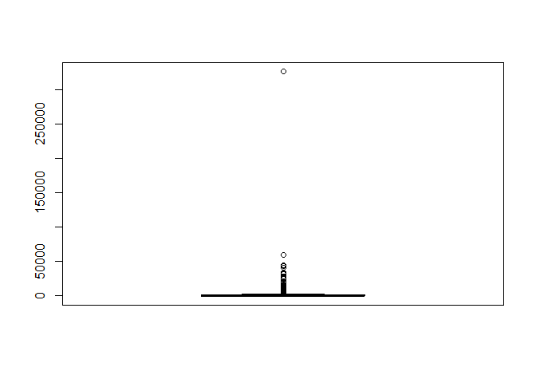<!-- -->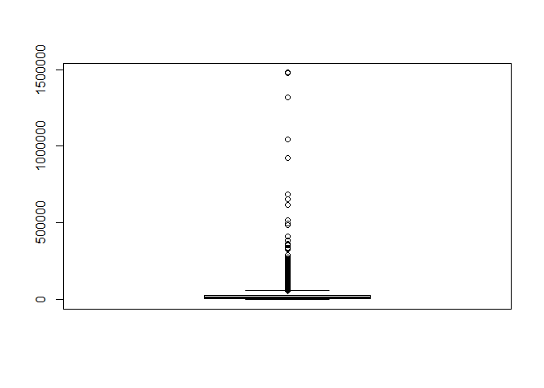<!-- -->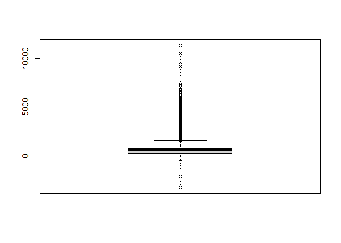<!-- -->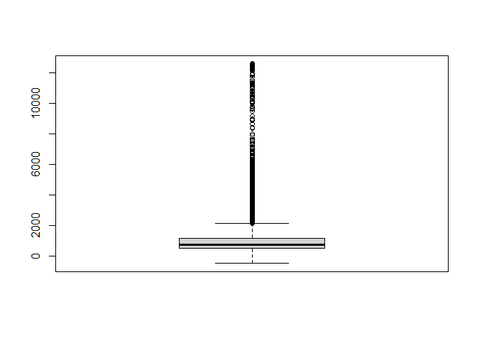<!-- -->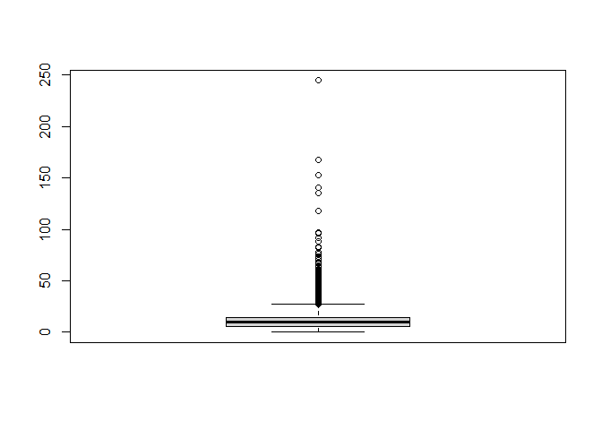<!-- -->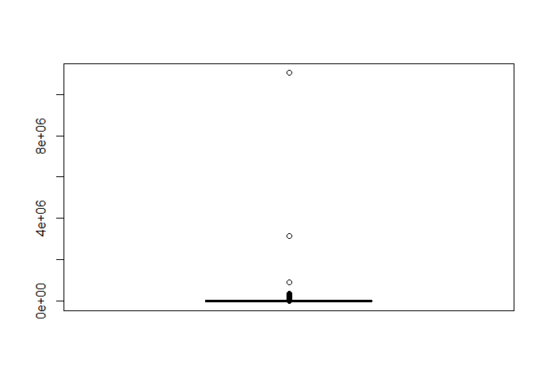<!-- -->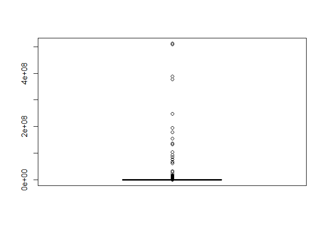<!-- -->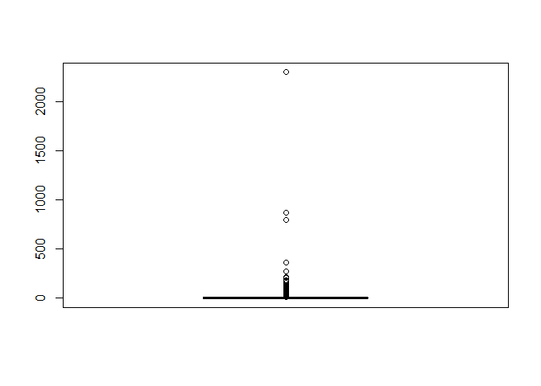<!-- -->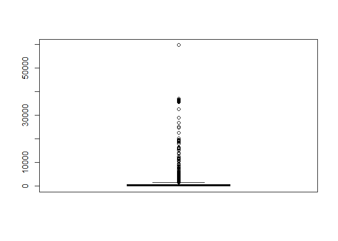<!-- -->

Por medio de los graficos se puede apreciar que efectivamente existen
datos que son atipicos en cada una de las variables. Por ende, se
procede a aplicar filtros para de esta manera sacar aquellas
observaciones. Cabe destacar que los graficos aparecen sin leyenda pero
es posible entender que siguen el orden de las variables del dataset
sport. A su vez, se hará el mismo filtro para el dataset sport2.

``` r
sport <- filter(sport ,sport$calories < 2500)
sport <- filter(sport ,sport$distance < 50000)
sport <- filter(sport ,sport$elev_low < 2500)
sport <- filter(sport ,sport$elev_low > -1000)
sport <- filter(sport ,sport$elev_high < 5000)
sport <- filter(sport ,sport$max_speed < 50)
sport <- filter(sport ,sport$moving_time < 25000)
sport <- filter(sport ,sport$elapsed_time < 15000)
sport <- filter(sport ,sport$average_speed < 30)
sport <- filter(sport ,sport$total_elevation_gain < 2000)
sport2 <- filter(sport2 ,sport2$calories < 2500)
sport2 <- filter(sport2 ,sport2$distance < 50000)
sport2 <- filter(sport2 ,sport2$elev_low < 2500)
sport2 <- filter(sport2 ,sport2$elev_low > -1000)
sport2 <- filter(sport2 ,sport2$elev_high < 5000)
sport2 <- filter(sport2 ,sport2$max_speed < 50)
sport2 <- filter(sport2 ,sport2$moving_time < 25000)
sport2 <- filter(sport2 ,sport2$elapsed_time < 15000)
sport2 <- filter(sport2 ,sport2$average_speed < 30)
sport2 <- filter(sport2 ,sport2$total_elevation_gain < 2000)
sport$typeCode <- as.factor(sport$typeCode)
sport2$typeCode <- as.factor(sport2$typeCode)
```

Luego, se procede a realizar nuevamente los graficos de boxplot, para de
esta manera corroborar si nuestra limpieza fue exitosa

``` r
for (i in 1:(ncol(sport) - 1)) {
  
  boxplot(sport[, i])
    
}
```

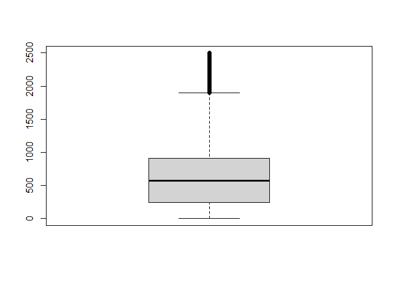<!-- -->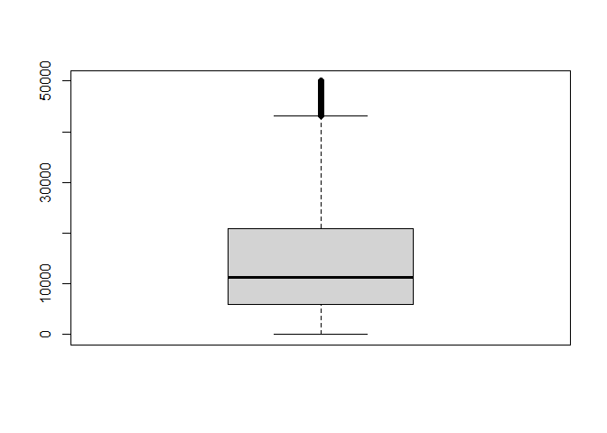<!-- -->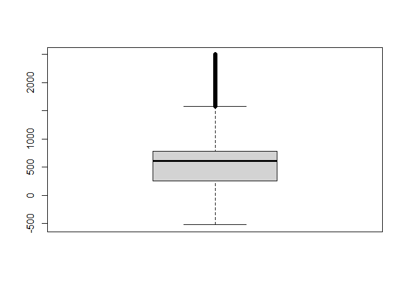<!-- -->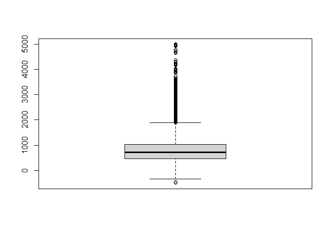<!-- -->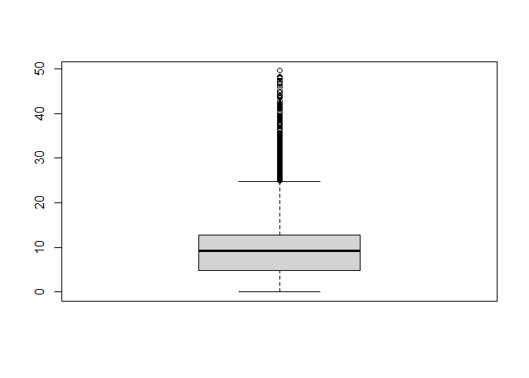<!-- -->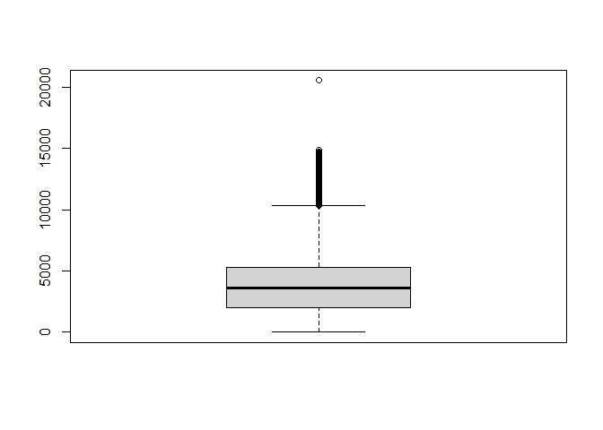<!-- -->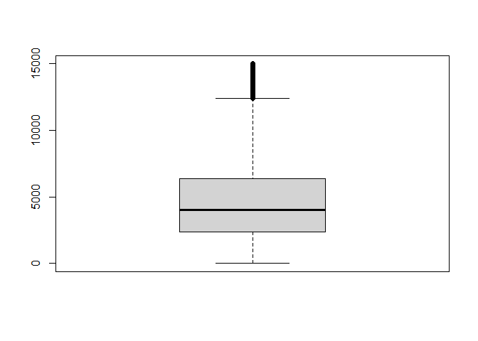<!-- -->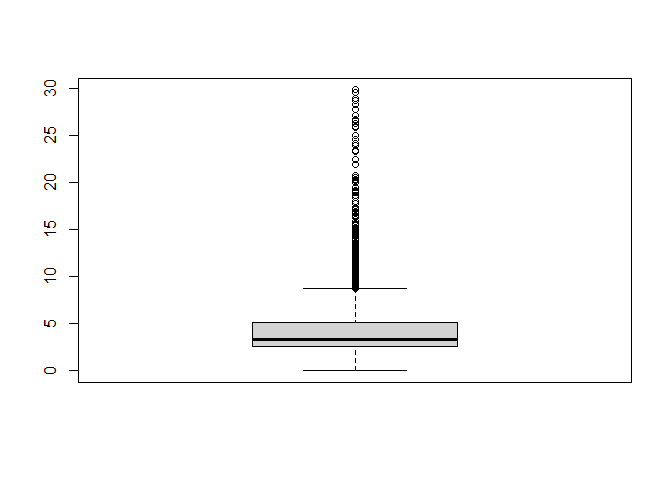<!-- -->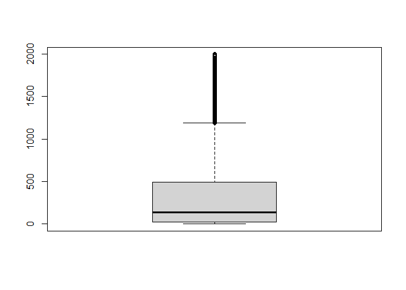<!-- -->

Podemos apreciar una clara diferencia con los datos anteriores, por ende
en este momento es posible continuar con el analisis. Estas diferencias
que quedan luego de filtrar los datos pueden deberse a que quizas hay
ciertos atletas que hicieron registros reales y que tienen capacidades
fisicas mejores que el restp, y por ende quedan como outliners, pero no
es necesario eliminarlos.

Como ultimo paso previo a entrenar los modelos de clasificacion, debemos
escalar la data y asi evitar problemas por la magnitud de los datos.

``` r
tipos <- data.frame(sport$typeCode)  
sport <-data.frame(scale(sport[0:9]))  
sport <- cbind.data.frame(sport, tipos)
sport_copia <- sport
```

## Modelo de Clasificacion

El primer objetivo del proyecto consiste en un problema de
clasificación, en el cual es posible identificar dos categorias que
predominan. En base a esto se esocgió utilizar un modelo de maquinas de
soporte vectorial (acorde a lo que nos ha sido enseñado tanto en clases
como en ayudantía), para de esta manera lograr el objetivo de esta
parte.

Es importante hacer un proceso que se nos recalco en clases, el cual es
generar dos datasets nuevos, y que estos sean uno para entrenar el
modelo, y otro para testear y comprobar su precisión una vez generado.
Esto sera en sport\_train y sport\_test

``` r
sport_sample <- sport[sample(nrow(sport), 25000),]
set.seed(500)
sport_split <- initial_split(sport_sample, prop = 0.7)
sport_train <- training(sport_split)
sport_test <- testing(sport_split)
```

Continuando con nuestro analisis debemos generar la maquina de soporte
vectorial. Para esto quizimos hacer lo mas directo posible, por ende,
nos guiamos en base a materia vista en clases. Para de esta ir creando
los modelos SVM y proseguir con nuestros objetivos.

``` r
receta <- 
  recipe(sport.typeCode ~ ., data = sport_train) 
```

Para esto se creara una función que permitira entrenar el modelo. Esta
tendra de componentes el grado del modelo que se desea trabajar, y luego
se realizaran predicciones en base a la data de testeo. Todo esto
siguiendo la linea de lo que nos fue explicado a lo largo de las clases
del semestre.

``` r
model_SVM <- function(grado){
  
  model <- svm_poly(degree = grado)    %>%
            set_engine("kernlab")       %>%
            set_mode("classification")  %>%
            translate()
  
  modelFit <-  workflow()              %>%
                add_model(model)       %>%
                add_recipe(receta)      %>%
                fit(data = sport_train)
  
  model_prediccion <- predict(modelFit, sport_test, type = "prob")  %>%
                      bind_cols(sport_test)
  
  model_prediccion %>% roc_auc(truth = sport.typeCode, .pred_0)
  return(model_prediccion %>% roc_auc(truth = sport.typeCode, .pred_0))
}
```

De esta manera proseguimos con probar el modelo bajo diferentes tipos de
grados, y así escoger el modelo ideal, segun lo que vimos en las
diferentes clases orientadas para este proyecto en el semestre.

``` r
model_SVM(1)
```

    ## # A tibble: 1 x 3
    ##   .metric .estimator .estimate
    ##   <chr>   <chr>          <dbl>
    ## 1 roc_auc binary         0.935

Podemos apreciar que el resultado que entrega con grado 1 este modelo es
muy bueno, de hecho de un 93.63%, lo cual da un muy buen porcentaje de
explicación del modelo para poder clasificar. De todas maneras
probaremos con otros valores de grados para ver si logramos un
porcentaje de explicacion mayor.

``` r
model_SVM(2)
```

    ## # A tibble: 1 x 3
    ##   .metric .estimator .estimate
    ##   <chr>   <chr>          <dbl>
    ## 1 roc_auc binary         0.988

Al probar el modelo con un grado igual a 2 en la funcion, vemos que le
resultado de explicacion es mucho mejor, teniendo un valor de 98.78%.
Esto es muy cercano al 100%, por ende, probaremos con un grado mas para
ver si es posible mejorar el valor anterior.

``` r
model_SVM(3)
```

    ## # A tibble: 1 x 3
    ##   .metric .estimator .estimate
    ##   <chr>   <chr>          <dbl>
    ## 1 roc_auc binary         0.990

``` r
#model_SVM(4)
```

Se intento correr el modelo con un grado igual a 4, lamentablemente no
fue posible debido a las caracteristicas de mi computador (ya que al
intentarlo llevaba haciendo los calculos 20 minutos), pero es suficiente
en nuetra opinion quedarnos con el SVM de grado 3. Ya que este entrega
un resultado muy bueno, porque es capaz de explicar en aproximadamente
un 99% el modelo, lo cual es excelente. Si bien, sabemos que el valor es
un poco mayor que el de grado 2, consideramos que el valor del grado 3
es suficientemente bueno.

Se decidio no intentar usar otro metodo, ya que el porcentaje de
explicacion es bastante alto, por ende, en nuestra opinion no vemos
necesario hacer otro modelo.

## Actividades Calificadas Erróneamente

En esta parte se hara el objetivo secundario de este encargo,
identificar las actividades que fueron registradas errónameante por los
usuarios.

Para esto se utlilizara el modelo de grado 3 obtenido en los pasos
anteriores. Aquellos registros que fueron ingresados erroneamente se
guardaran en una base nueva, que se llamara sport\_x. Luego se
realizaran los pasos que vimos en las clases del ramo.

``` r
modelo <- svm_poly(degree = 3)    %>%
          set_engine("kernlab")       %>%
          set_mode("classification")  %>%
          translate()

modeloFit <-  workflow()              %>%
              add_model(modelo)       %>%
              add_recipe(receta)      %>%
              fit(data = sport_train)

modeloPrediccion <- predict(modeloFit, sport_copia, type = "prob")  %>%
                    bind_cols(sport_copia)
```

De esta manera obtenemos las probabilidades de que cada registro de
actividad pertenezca al tipo de deporte que se hizo. Es posible comparar
la probabilidad de que pertenezca a los que son a pie vs los que son en
bicicleta. De esta manera si la probailidad de que sea una actividad
hecha a pie es mayor a la que haya sido en bicicleta, quiere decir que
esa actividad pertenece a actividades hechas a pie. Esto sera guardado
en la base de datos sport2. Segun lo que se estipulo al comienzo de este
ejercicio.

Esto se puede deber a temas desde distancia recorrida, velocidad, etc.

Entonces por medio de este condicional sera posible identificar si las
actividades fueron ingresadas de manera correcta o erronea.

``` r
sport2$prediccion <- ifelse(modeloPrediccion$.pred_0 >= modeloPrediccion$.pred_1, 0, 1)
```

Al hacer esto, podemos ver por medio de inspeccion visual que ahora en
la variable sport2 exiten ciertas actividades que han sido categorizadas
con un 1 o 0. Lo cual hace referncia a que hay actividades que segun sus
caracteristicas es mas probable que hayan sido realizadas tanto a pie
como en bicileta.

Por ende, en este paso se procede a comparar las variables cateogrizadas
en un comienzo, con las de la base de datos sport2. De esta manera se
almacenan en sport\_x.

``` r
sport_x <- sport2 %>% filter(typeCode != prediccion)
```

Finalmente, se muestra por medio de un head como ha cambiado la
clasificación de cada registro de actividad, mostrando 6 entradas.

``` r
head(sport_x)
```

    ##   calories distance elev_low elev_high max_speed moving_time elapsed_time
    ## 1    114.6   2944.7    604.0     647.2    15.500        1069         1260
    ## 2    104.3   2423.4    603.9     635.6     6.800         799          937
    ## 3    549.7   2403.9    349.3     379.0    11.600        3213         3243
    ## 4    291.4   3456.9    627.8     649.0    15.400         308          325
    ## 5    771.1  26650.8    563.9     783.9    33.679        6168         6785
    ## 6    195.4   5294.7    338.2     369.9     8.100        2254         2408
    ##   average_speed total_elevation_gain typeCode prediccion
    ## 1         2.755                 49.1        0          1
    ## 2         3.033                 31.6        0          1
    ## 3         0.748                 32.9        0          1
    ## 4        11.224                 11.0        1          0
    ## 5         4.321                333.2        0          1
    ## 6         2.349                 65.3        0          1

Finalmente, se procede a mostrar cuantos registros fueron ingresados de
manera erronea, estos son 4866.

``` r
nrow(sport_x)
```

    ## [1] 4889

# Conclusion

A modo de conclusion podemos apreciar que existe una cierta cantidad de
registros que fueron ingresados de manera erronea. Esto puede deberse a
diversos factores, desde que por estar con prisa ingresaron mal el tipo
de actividad, hasta que quizás qurian engañar al sistema y asi obtener
un buen registro.

Por ende, lo que se podría implementar en todo este tipo de dispositivos
es una fase de confirmación al momento de elegir la actividad deportiva
que se va a realizar. Quizas sigan habiendo personas que vayan a
ingresar de mala voluntad la actividad, pero tambien estan los que
sencillamente se equivocan al ingresar el tipo de deporte y estos
deberian disminuir ya que podrian confirmar y elegir de manera correcta
su actividad fisica.

Por otra parte, podria quizas se podria empezar a trabajar con algun
modelo mas complejo, que permita de acuerdo a las pulsaciones determinar
ciertos patrones, y en base a esto que la aplicacion por si misma te
ayude a corroborar si es que la actividad fue ingresada de manera
correcta.
